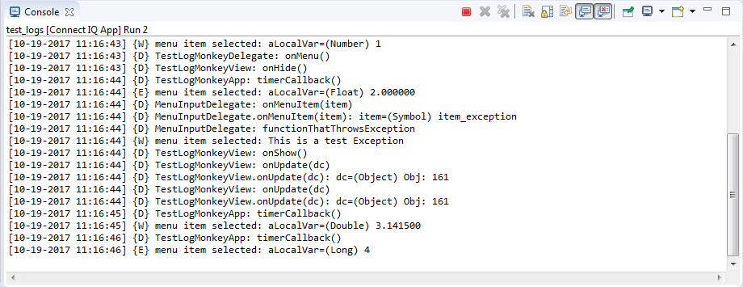

# LogMonkey
The LogMonkey barrel provides logging utilities to aid in developing and debugging Connect IQ applications. Information can be logged to certain log levels via the available APIs. The supported log levels are:

| API             | Purpose                                                |
| --------------- | ------------------------------------------------------ |
| LogMonkey.Debug | General debugging information                          |
| LogMonkey.Warn  | Warning messages about potential issues within the app |
| LogMonkey.Error | Errors that have occurred within the app               |

## Adding LogMonkey to Your Project
See the general instructions for [including Monkey Barrels](https://github.com/garmin/connectiq-apps/tree/master/barrels#including-monkey-barrels).

## Logging Information
Once LogMonkey has been added to your project, import it into your code with a `using` statement:

```
using LogMonkey as Log;
```

Once imported messages, variables and Exceptions can be logged with the available APIs:

```
using LogMonkey as Log;

class MyClassOfThings {

    function aFunctionOfLogic(aParameter) {
        Log.Debug.logMessage("MyClassOfThings", "aFunctionOfLogic()");
        Log.Debug.logVariable("aFunctionOfLogic() param", "aParameter", aParameter);
        ...
        try {
            ...do something horribly, horribly wrong...
        } catch (ex) {
            Log.Error.logException("Attempting to do XYZ", ex);
        }
        ...
        if (aLocalVariable == aPotentiallyProblematicValue) {
            Log.Warn.logVariable("aFunctionOfLogic()", "aLocalVariable", aLocalVariable);
        }
        ...
    }

}
```

## Viewing and Parsing Logs
LogMonkey makes use of `Toybox.System.println()` calls to log information. This means that if your app also makes use of `println()` calls they will show up alongside the log entries.

### Output Format
LogMonkey generates messages in the following format:

 `(log format version)[timestamp] {log level} tag: message`.
 
Details for each block of this format are given in the table below:

| Block              | Format                                                    | Description                                                                         |
| ------------------ | --------------------------------------------------------- | ----------------------------------------------------------------------------------- |
| log format version | A value beginning with "lfm" then a number                | The output format version of the line in the log.                                   |
| timestamp          | YYYY-MM-DD HH:MM:SS                                       | A time stamp of when the log entry occurred.                                        |
| log level          | A string containing only letters, numbers and underscores | The priority level of the log entry. LogMonkey supports values of `D`, `W` and `E`. |
| tag                | A string containing any character except a colon (`:`)    | A brief tag value that can be used to quickly filter and find specific log entries. |
| message            | Any string value                                          | The detailed message being recorded in the log entry.                               |

### Viewing Logs in Eclipse
When an app is run within the Connect IQ Simulator through Eclipse, the run console will show the output of log calls in the raw LogMonkey output format:



### Viewing Logs on a Device
When an app is run on a physical device, log statements get added to the app's log file. The app log file doesn't get created automatically, so if it doesn't already exist, it will need to be created as a `TXT` file in the `/GARMIN/APPS/LOGS` directory on the device. The app log file name must match the name of the app's `PRG` file (located in `/GARMIN/APPS`). 

### Parsing Logs
There is a [parse_log_file.py](parse_log_file.py) [Python](https://www.python.org/) script provided that can parse and filter log files to help find relevant log entries while developing an app. The script accepts raw LogMonkey files as well as log level and tag filters to narrow down log output. If other pieces of information are contained in the file that information will be ignored by the script. Here's a basic usage example:

```
python parse_log_file.py -l E -t communication my_log_file.txt
```

For detailed script use run the help command: `python parse_log_file.py -h`.
