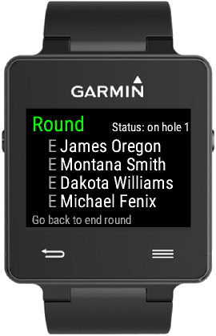
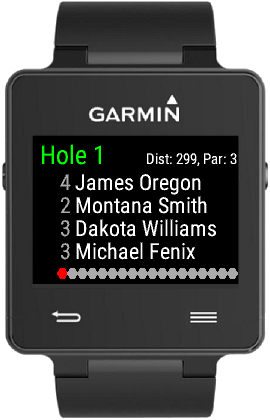
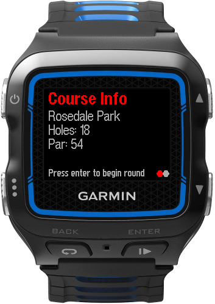
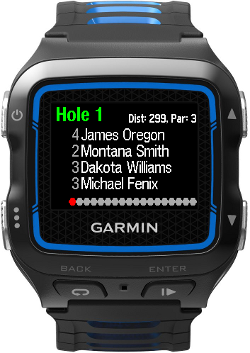
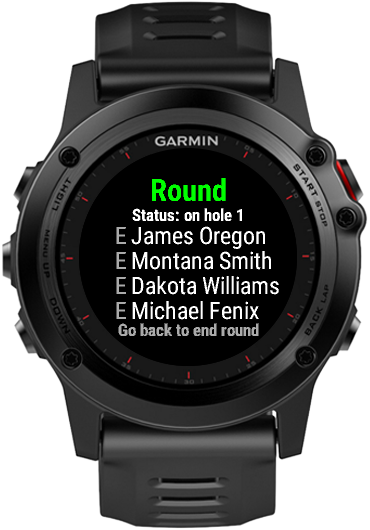
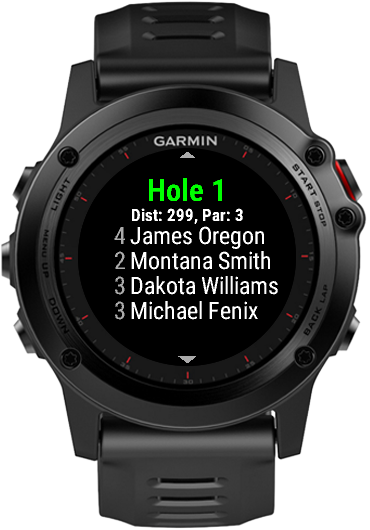

# Disc Golf IQ

A simple scoring app for disc golf. Use the companion mobile app to create a course and send it to your watch. You can then score your round on the watch and send the completed scorecard back to your phone.

### Store Links
[Connect IQ Store](https://apps.garmin.com/en-US/apps/8a22bbaa-2612-4084-b062-1b6d4adfa181)

[Google Play Store](https://play.google.com/store/apps/details?id=com.garmin.android.apps.samples.discgolf)

### Screenshots

